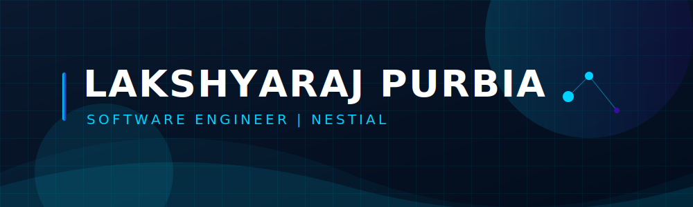

  
  
    
  
  

    

  

    <b>Software Engineer | Founder of Nestial | DevOps & Cloud Native</b>
  

  
  

    
    
    
  

### 👨‍💻 About Me

Hi, I'm Lakshyaraj Purbia.

I'm a Software Engineer focused on building products that solve real problems. My work spans the entire engineering stack—from low-level programming in C/C++ to scalable backend systems, modern React applications, Linux infrastructure, and cloud-native deployments.

I'm the founder of **Nestial Technologies**, where I'm building multiple products and services from the ground up, focusing on scalability, performance, and developer experience. This journey has allowed me to wear many hats: software engineer, backend developer, DevOps engineer, system administrator, and product builder.

I enjoy designing clean architectures, optimizing systems, and turning ideas into production-ready software. Beyond coding, I manage self-hosted infrastructure, work extensively with Docker and Linux, and continuously explore technologies like Go, Kubernetes, distributed systems, and modern DevOps practices.

I'm looking for opportunities where I can contribute to ambitious engineering teams, solve meaningful technical challenges, and continue growing as a software engineer while building technology that makes a lasting impact.

### 🚀 Tech Stack

  

### 📊 GitHub Stats

  

 

  <h4>🐍 My Contributions</h4>
  <picture>
    <source media="(prefers-color-scheme: dark)" srcset="https://raw.githubusercontent.com/lakshya2106/lakshya2106/output/github-contribution-grid-snake-dark.svg?palette=github-dark">
    <source media="(prefers-color-scheme: light)" srcset="https://raw.githubusercontent.com/lakshya2106/lakshya2106/output/github-contribution-grid-snake.svg">
    
  </picture>

 

  

